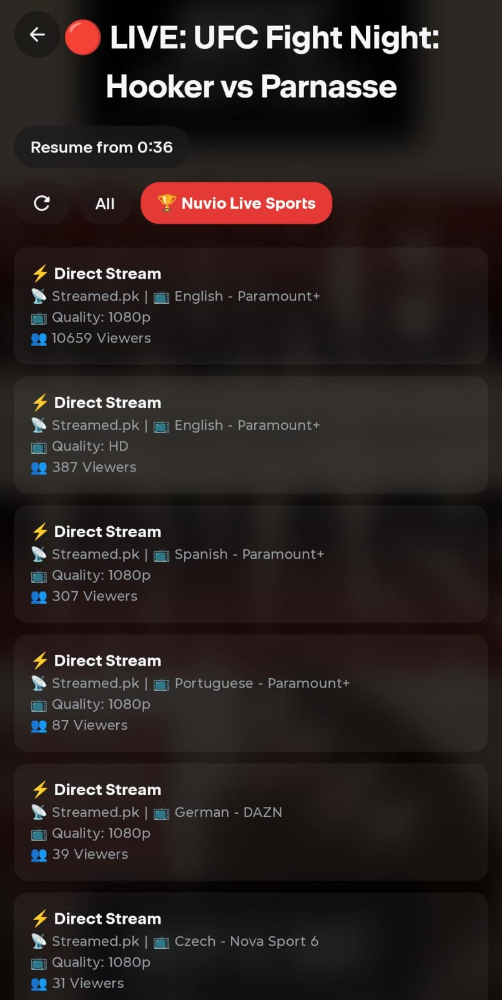

<p align="center">
  
</p>

# 🔴 Nuvio Live Sports Plugin

[](https://ko-fi.com/rajodedara)
[](https://github.com/rajhodedara/live-sport-plugin)
[](https://opensource.org/licenses/MIT)
[](#)

> ℹ️ **Hosting note:** free PaaS tiers (Render, Railway, Vercel) work but may enforce acceptable-use policies against scrapers and media proxying. A small VPS, a spare PC or a Raspberry Pi behind a Cloudflare Tunnel is the safest long-term home.

> ☕ **Enjoying Nuvio Live Sports?** Consider [supporting the project on Ko-fi](https://ko-fi.com/rajodedara) to help cover maintenance, dedicated scrapers, and infrastructure!

A production-grade live sports streaming add-on for [Nuvio](https://nuvio.tv) and [Stremio](https://www.stremio.com/). It serves as a powerful multi-source aggregator that provides native live sports streams (Football, Basketball, Motorsport, Cricket, and more) inside your client, utilizing an advanced internal stream resolver to bypass CORS restrictions.

---

## 📱 App Preview & Screenshots

<p align="center">
  
</p>

| 🏎️ F1 & Baseball Catalogs | ⚡ 1080p Direct Stream Picker | ⚙️ Addon Details & Luffy Logo |
|:---:|:---:|:---:|
|  |  |  |

---

## 🚀 Self-Hosting Guides (Recommended)

### Option 1: Docker / Docker Compose (Easiest for Servers & Raspberry Pi)

Run the addon container in seconds:

```bash
# Clone the repository
git clone https://github.com/rajhodedara/live-sport-plugin.git
cd live-sport-plugin

# Start the container in background
docker compose up -d
```

The addon is now available at `http://localhost:7000` (or `http://YOUR_SERVER_IP:7000`).

---

### Option 2: Local Node.js (Same Wi-Fi / Local Network or Cloudflare Tunnel)

1. **Install and run the addon:**
   ```bash
   git clone https://github.com/rajhodedara/live-sport-plugin.git
   cd live-sport-plugin
   npm install
   npm run build
   npm start
   ```

2. **Access from other Devices on the Same Wi-Fi (Phone, TV, another Laptop):**
   - Find your host computer's local IPv4 address:
     - **Windows:** Open Command Prompt (`cmd`) and type `ipconfig` (look for `IPv4 Address`, e.g., `192.168.1.50`).
     - **Mac / Linux:** Open Terminal and type `ifconfig` or `ip a` (e.g., `192.168.1.50`).
   - On any phone/tablet/laptop connected to the same Wi-Fi, open your browser:
     ```
     http://<YOUR_IPV4_ADDRESS>:7000/configure
     ```
     *(Example: `http://192.168.1.50:7000/configure`)*
   - Configure your settings, copy the link, and paste into Nuvio / Stremio!

3. **(Optional) Expose Outside Home via Cloudflare Tunnel (`cloudflared`):**
   - Download [`cloudflared`](https://developers.cloudflare.com/cloudflare-one/connections/connect-networks/downloads/).
   - Run a quick tunnel:
     ```bash
     cloudflared tunnel --url http://127.0.0.1:7000
     ```
   - Open `https://your-tunnel-url.trycloudflare.com/configure` and install anywhere outside your home network!

*(Alternative: You can also use [Ngrok](https://ngrok.com) by running `ngrok http 127.0.0.1:7000`).*

---

### Option 3: Linux VPS with PM2 (Production 24/7)

```bash
# Clone and build
git clone https://github.com/rajhodedara/live-sport-plugin.git
cd live-sport-plugin
npm install
npm run build

# Install PM2 and start the service
npm install -g pm2
pm2 start dist/index.js --name "nuvio-sports"
pm2 save
pm2 startup
```

---

## ✨ Key Features

- **🏟️ 11 aggregated sources, 7 of them direct:** Streamed, StreamFree, PPV.ST, SportsindX/WatchSports, WatchFooty, NTV and TimStreams resolve to native HLS that plays *inside* Nuvio/Stremio. StreamSports99 and CDNLiveTV are direct when their channel page can be decoded. Streamic and SportyHunter are browser-only and off by default.
- **🔓 Native decryption, no headless browser:** embed.st (`stream-lock.wasm`), embedindia.st (`gasm.wasm`) and sportsembed.su tokens are minted in-process, so PPV, SportsindX and NTV events become direct streams instead of "open in browser" links.
- **🧲 Generic embed resolver:** any remaining embed page is fetched server-side, scanned for plain / JSON / base64 / XOR-obfuscated playlists and nested iframes, and promoted to a direct stream when found. Browser fallback stays as the last resort.
- **⚡ Coalescing HLS manifest proxy (`/api/manifest`):** keep-alive upstream client, in-flight request coalescing and 15 s negative caching so a live player poll never hammers a dead CDN.
- **🔄 Fresh catalogs:** full provider re-sync every 10 minutes (cron), traffic-driven stale-while-revalidate after 3 minutes, a rate-limited manual **Refresh** button on the dashboard and short client cache hints so Nuvio picks up live status changes quickly.
- **🛡️ Self-healing HLS gateway (`/api/hls/<key>/…`):** every direct stream gets a permanent URL. The server fetches playlists and segments with the right headers, re-mints the source automatically when a token expires or a CDN node dies, and serves the last good playlist while it does, so the player keeps going instead of erroring out mid-game.
- **📈 Source reliability scoring:** every verification and playback outcome feeds a rolling score per source. The picker is sorted by that score (then resolution), unreliable sources are hidden while healthier ones exist, and browser streams only show when nothing direct is available.
- **🧠 Verified, ranked streams:** every direct stream is pre-flighted once per mint (dead 403/404/5xx and fake 200 bodies are dropped), de-duplicated by upstream URL, then sorted direct-first by quality and source reliability. Optional **"Hide browser-only streams"** setting.
- **🖼️ Resilient image pipeline (`/img`):** cached proxy with generated SVG fallbacks, so posters and crests never break.
- **🌐 Dynamic host routing:** manifests, streams and images are rewritten to whatever host the client used (Render, Cloudflare Tunnel, LAN IP, custom domain).
- **⚙️ Clear setup UI:** `/configure` groups sources by *Direct / Mixed / Browser*, offers one-click presets, live link preview and install steps for Nuvio and Stremio. `/` is a dashboard with provider health, a refresh button and a built-in player for testing.

### Source overview

| Source | Kind | Notes |
|---|---|---|
| Streamed (streamed.pk) | Direct | admin / echo / delta / golf backends via embed.st WASM |
| StreamFree | Direct | up to 2160p, team logos, leagues |
| PPV.ST | Direct | events + 24/7 channels via embedindia.st WASM |
| SportsindX / WatchSports | Mixed | Streamed backends direct, third-party embeds via generic resolver |
| WatchFooty | Direct | sportsembed.su native decryption |
| NTV | Direct | Streamed mirror with posters; catalog fallback when streamed.pk is blocked |
| TimStreams | Mixed | XOR de-obfuscation, browser fallback |
| StreamSports99 / CDNLiveTV | Mixed | decoded channel pages, browser fallback |
| Streamic / SportyHunter | Browser | off by default |

### Refresh tuning (environment variables)

| Variable | Default | Meaning |
|---|---|---|
| `CATALOG_SYNC_CRON` | `*/10 * * * *` | full provider re-sync schedule |
| `CATALOG_REVALIDATE_MS` | `180000` | catalog age after which the next request triggers a background re-sync |
| `LOW_MEMORY_MODE` | unset | `true` = fetch providers sequentially (256 MB hosts) |
| `STREAM_DEADLINE_MS` | `8000` | a `/stream` request answers after this with the sources that are ready; the rest keep resolving in the background |
| `PREWARM_LIVE` / `PREWARM_CRON` / `PREWARM_MAX` | `true` / `*/3 * * * *` / `8` | pre-resolve streams for live matches so the picker opens instantly |
| `RELAY_SEGMENTS` | `true` | media segments are relayed through the server so IP-bound CDN tokens work for every player; set `false` to let players fetch segments directly (saves bandwidth, breaks some sources) |

### Useful endpoints

| Endpoint | Purpose |
|---|---|
| `GET /api/status` | last sync time, per-provider counts and timings, open circuit breakers, stream-cache stats |
| `POST /api/refresh` | force a re-sync (rate limited to once per 45 s) |
| `GET /api/sources` | source registry used by the configure page |
| `GET /health` | liveness probe used by Render / Docker |

---

## 🛠️ Tech Stack

| Layer | Technologies |
|---|---|
| **Runtime & Core** | [Node.js](https://nodejs.org/) (v22+ LTS), [Express.js](https://expressjs.com/) |
| **Addon Protocol** | [stremio-addon-sdk](https://github.com/Stremio/stremio-addon-sdk) (Stremio v1 Protocol) |
| **Architecture & IoC** | [Awilix](https://github.com/jeffijoe/awilix) (Dependency Injection / IoC Container), Domain-Driven Design (DDD) |
| **High-Performance HTTP & TLS** | [Impit](https://github.com/impit-dev/impit) (Native HTTP client with TLS/browser fingerprint impersonation), [Undici](https://undici.nodejs.org/) |
| **WASM Decryption Engines** | Native WebAssembly execution (`stream-lock.wasm`, `gasm.wasm`, `gasm_india.wasm`) |
| **Scraping & DOM Extraction** | [Cheerio](https://cheerio.js.org/), [Happy DOM](https://github.com/capricorn86/happy-dom), [jsdom](https://github.com/jsdom/jsdom), [got-scraping](https://github.com/apify/got-scraping) |
| **Resilience & Fault Tolerance** | [Opossum](https://nodeshift.dev/opossum/) (Circuit Breakers), In-Flight Request Coalescing, Negative Cache Maps |
| **Streaming & Playlists** | [m3u8-parser](https://github.com/videojs/m3u8-parser), Dynamic M3U8 segment rewriter |
| **Background Scheduling** | [node-cron](https://github.com/node-cron/node-cron) (Periodic match aggregator sync) |
| **Encoding & Compression** | [lz-string](https://github.com/pieroxy/lz-string) (URL-safe base64url configuration compression) |
| **Production Bundler** | [@vercel/ncc](https://github.com/vercel/ncc) (Single CJS distribution with native WASM asset copying) |

---

## 📋 Prerequisites

Before setting up the project locally:
- **Node.js**: Version `22.0.0` or higher (LTS recommended)
- **npm**: Version `10.0.0` or higher (bundled with Node.js)
- **Git**: Installed and accessible from your terminal

---

## 🚀 Development Workflow

```bash
# 1. Install dependencies
npm install

# 2. Start development mode with native watch reload
npm run dev

# 3. Build for production (bundles with @vercel/ncc and copies WASM runtimes)
npm run build

# 4. Launch the compiled production server
npm start

# 5. Scaffold a new scraper from template
npm run generate:provider
```

---

## 🎛️ Configuration Options

Through the interactive `/configure` UI (or via URL-safe base64 config segments), you can customize:
- **Sports Filtering:** Select from 14+ sports categories (Soccer, Basketball, Cricket, F1 & Racing, NFL, Hockey, Baseball, MMA, Golf, Tennis, Rugby, College Sports, Darts, Other).
- **Streaming Sources Selection:** Individually enable or disable sources (Streamed, StreamFree, PPV.ST, SportsindX, WatchFooty, NTV, TimStreams, StreamSports99, CDNLiveTV, Streamic, SportyHunter) with *Recommended* / *Direct only* presets.
- **Hide browser-only streams:** list only streams that play natively inside the app.
- **Localization & Timezones:** Auto-detects or manually configures your local IANA timezone to render match kick-off schedules in your local time.
- **Priority Tracking ("⭐ Your Teams"):** Enter comma-separated favorite clubs or athletes (e.g. `Arsenal, Lakers, Ferrari`) to dynamically generate a dedicated priority catalog.

---

## 🧪 Testing & Verification Suites

The project features a multi-tiered test suite including unit tests, adversarial stress tests, and automated Stremio client simulations:

```bash
# Run unit & service test suites with Jest
npm test

# Run simulated Stremio client E2E test (verifies manifest, catalogs, and streams)
npm run test:e2e-client

# Run live upstream scraper health check across all providers
npm run check-sources

# Validate 24/7 channel and live TV endpoints
npm run test:247
```

---

## ☁️ Deployment Instructions

### Option 1: Render.com (Recommended for One-Click)
This project is configured for deployment on Render.com using the `render.yaml` blueprint.
1. Push your repository to GitHub.
2. Link your repo to Render and create a new **Web Service**.
3. Render automatically sets up the environment and launches both the Express server and the child resolver process.
